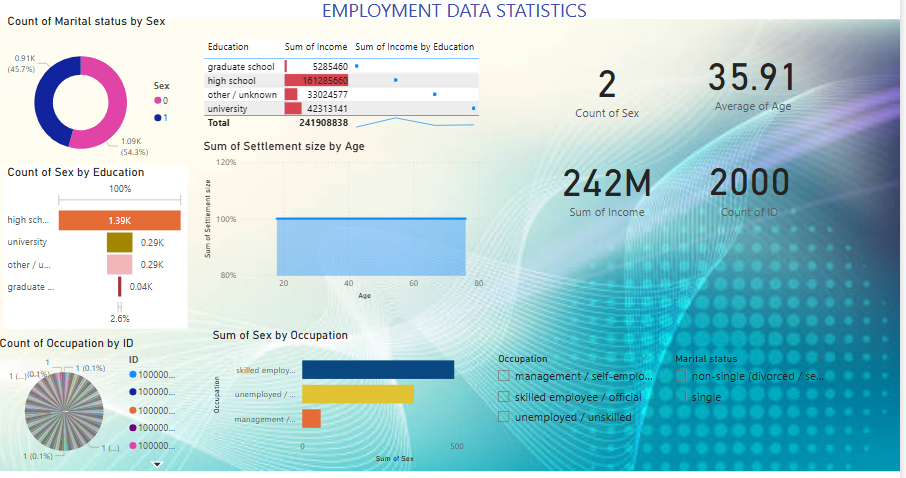

💼 Employment Data Statistics Dashboard (Power BI)
📌 Project Overview

This project presents an interactive Power BI dashboard analyzing employment and demographic data.
The dashboard provides insights into income distribution, education levels, occupation types, age patterns, and marital status.

It helps stakeholders understand:

Workforce composition
Income distribution trends
Education impact on earnings
Occupational structure
Demographic patterns
🖼 Dashboard Preview

---

📈 Key Performance Indicators (KPIs)
KPI	Value	Description
Total Records (ID)	2000	Total number of individuals
Total Income	242M	Combined income of all individuals
Average Age	35.91	Mean age of individuals
Gender Count	2	Number of gender categories
🎓 Education & Income Analysis

This section highlights how income varies across different education levels.

Education Levels
Level
High School
University
Graduate School
Other / Unknown
Insights
Higher education levels correspond to higher income
University and graduate individuals earn significantly more
Education plays a key role in earning potential
📊 Employment & Occupation Analysis

This section shows workforce distribution across occupations.

Occupation Categories
Category
Management / Self-employed
Skilled Employee / Official
Unemployed / Unskilled
Insights
Skilled employees form the largest workforce group
Management roles contribute significantly to income
Unemployment category highlights economic gaps
👥 Demographic Analysis

This includes gender and marital status distribution.

Metrics Included
Gender distribution
Marital status (Single / Non-single)
Insights
Balanced gender participation
Variation in marital status across dataset
Useful for socio-economic analysis
📉 Age & Settlement Analysis

This section analyzes settlement size and age distribution.

Insights
Majority population falls in working-age group
Settlement trends remain stable across age groups
Helps understand urban vs rural patterns
📊 Income Distribution Insights
Insights
Income is unevenly distributed
High concentration among skilled and educated individuals
Reflects real-world economic inequality patterns
🎛 Dashboard Filters

Users can interact with the dashboard using:

Occupation Filter
Analyze specific job categories
Marital Status Filter
Single
Non-single
📊 Features of the Dashboard
Interactive Power BI visuals
Income and education correlation
Occupation-based insights
Demographic segmentation
Clean and analytical design
🧠 Business Insights
1️⃣ Income Inequality

Higher income is concentrated among educated and skilled individuals.

2️⃣ Role of Education

Education significantly impacts earning capacity.

3️⃣ Workforce Structure

Majority belong to skilled employment category.

4️⃣ Demographic Trends

Age and marital status influence employment patterns.

5️⃣ Economic Insights

Unemployment and low-skill jobs highlight areas for policy improvement.

🛠 Tools & Technologies
Tool	Purpose
Power BI	Data visualization
Dataset	Employment data
DAX	Measures & calculations
GitHub	Project hosting
📂 Project Structure

Employment-Data-Dashboard
│
├── Dataset
│ └── employment_data.csv
│
├── PowerBI
│ └── dashboard.pbix
│
├── Images
│ └── dashboard.png
│
└── README.md

🚀 How to Use
Download the .pbix file
Open in Power BI Desktop
Use filters to explore:
Income distribution
Education levels
Occupation categories
Demographic insights
Analyze insights interactively
📌 Future Improvements
Add time-series income trends
Include regional analysis
Add predictive modeling for income
Integrate real-time datasets
👩‍💻 Author

Vetali Mittal
Economics Honours Student | Data Enthusiast | Power BI Learner
